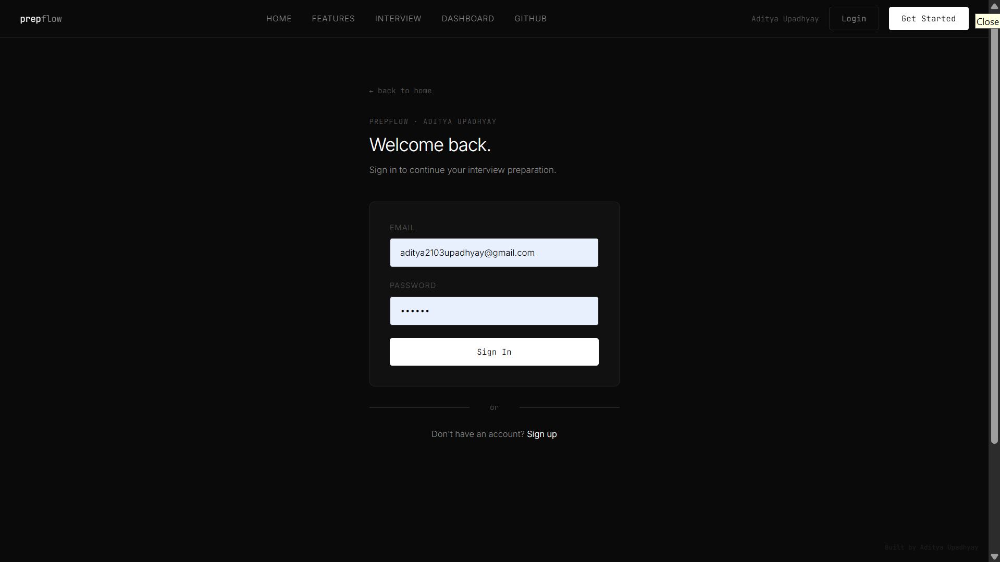
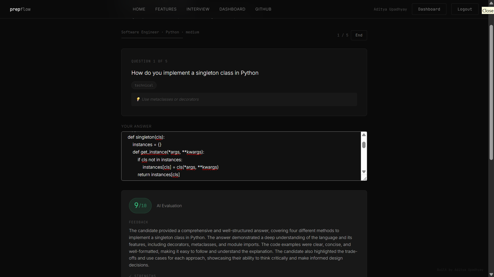
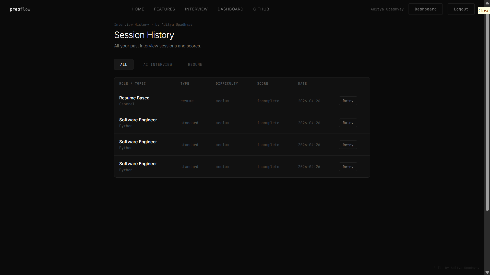
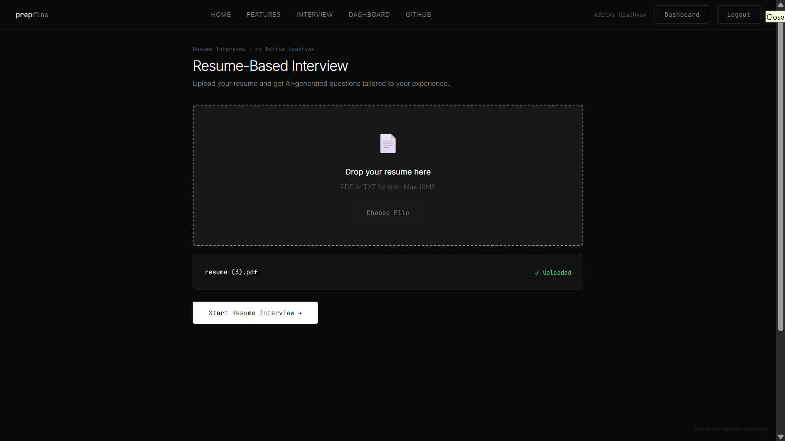

# 🚀 PrepFlow — AI-Powered Interview Preparation Platform

## 🔥 Overview

PrepFlow is a full-stack AI-powered interview preparation platform built by **Aditya Upadhyay**.
It enables users to practice coding problems, simulate interviews, and receive intelligent feedback using AI.

---

## ✨ Features

* 🔐 Secure Authentication System (Login / Signup)
* 💻 Interactive Coding Environment
* 🧠 DSA Problem Practice
* 🤖 AI-Powered Interview & Code Evaluation
* 📄 Resume-Based Interview System
* 📝 Session History Tracking

---

## 🛠 Tech Stack

* **Backend:** Flask (Python)
* **Frontend:** HTML, CSS, JavaScript (Jinja Templates)
* **Database:** SQLite
* **Deployment:** Render
* **AI Integration:** Groq API

---

## 📸 Screenshots

### 🔐 Login Page



---

### 💻 Coding Interface


---

### 🤖 AI Interview



---

### 📄 Resume-Based Interview


---

### 📊 Session History



---

### 📑 Resume Upload / Analysis



---

## 🚀 Live Demo

👉 https://prepflow-v1-1.onrender.com

---

## ⚙️ Installation

```bash
git clone https://github.com/AdityaQQ/PrepFlow-v1.1.git
cd PrepFlow-v1.1
pip install -r requirements.txt
python app.py
```

---

## 🔑 Environment Variables

```
GROQ_API_KEY=your_api_key
SECRET_KEY=your_secret_key
```

---

## 👨‍💻 Author

**Aditya Upadhyay**
