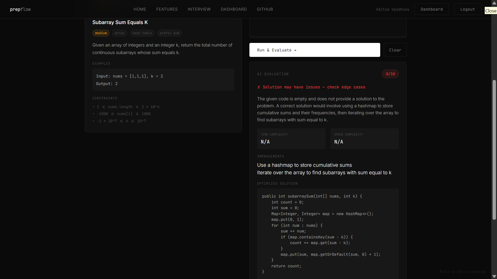

# 🚀 PrepFlow — AI-Powered Coding Interview Platform

## 🔥 Overview

PrepFlow is a full-stack AI-powered coding interview platform built by **Aditya Upadhyay**.
It allows users to practice DSA problems in a real coding environment and receive AI-based feedback on their solutions.

---

## ✨ Features

* 🔐 User Authentication (Login / Signup)
* 💻 Interactive Coding Editor
* 🧠 DSA Problem Practice (Two Sum, Max Subarray, etc.)
* 🤖 AI-Based Code Evaluation & Feedback
* ⚡ Real-time execution UI with scoring system

---

## 🛠 Tech Stack

* **Backend:** Flask (Python)
* **Frontend:** HTML, CSS, JavaScript (Jinja Templates)
* **Database:** SQLite
* **Deployment:** Render
* **AI Integration:** Groq API

---

## 📸 Screenshots

### 🖥️ Platform Overview


---

### 📊 Problem List & Dashboard



---

### 💻 Coding Interface


---

### 🤖 AI Evaluation


---

### 📈 Feedback & Results


---

### ⚡ Additional View


---

## 🚀 Live Demo

👉 https://prepflow-v1-1.onrender.com

---

## ⚙️ Installation (Local Setup)

```bash
git clone https://github.com/AdityaQQ/PrepFlow-v1.1.git
cd PrepFlow-v1.1
pip install -r requirements.txt
python app.py
```

---

## 🔑 Environment Variables

Create a `.env` file in the root directory:

```
GROQ_API_KEY=your_api_key
SECRET_KEY=your_secret_key
```

---

## 🧠 How It Works

1. User logs in or signs up
2. Selects a coding problem
3. Writes solution in the built-in editor
4. Submits code
5. AI evaluates and provides feedback

---

## 📌 Future Improvements

* Secure sandboxed code execution
* More advanced DSA problem sets
* Time & space complexity analysis
* Leaderboard and progress tracking

---

## 👨‍💻 Author

**Aditya Upadhyay**
B.Tech Computer Science
Kalinga Institute of Industrial Technology (KIIT)

---

⭐ Star this repo if you found it useful!
